# Azure Network Protocol Analysis

Two-VM environment deployed in Microsoft Azure to analyze 
live network traffic using Wireshark across five protocols, 
with real-time NSG firewall configuration and testing.

## Environment

- Resource Group: RG-Network-Activities (Canada Central)
- Windows 10 VM (windows-vm) - Private IP: 10.0.0.4
- Ubuntu 24.04 VM (linix-vm) - Private IP: 10.0.0.5
- Virtual Network: Lab01-Vnet/default (shared across both VMs)

## Tools Used

Microsoft Azure - Windows 10 - Ubuntu 24.04 - Wireshark 
- PowerShell - NSG - VNet

---

## VM Deployment

Two virtual machines deployed on the same Virtual Network 
so they can communicate directly over private IP addresses.

- Resource Group: RG-Network-Activities - Canada Central
- Windows 10 VM: windows-vm - Standard D2s v3 - IP 10.0.0.4
- Ubuntu 24.04 VM: linix-vm - Standard D2s v3 - IP 10.0.0.5
- Virtual Network: Lab01-Vnet/default confirmed on both VMs

Both VMs need to sit on the same VNet and Subnet to 
communicate using private IPs. Confirmed on the 
Networking tab of each VM before starting.

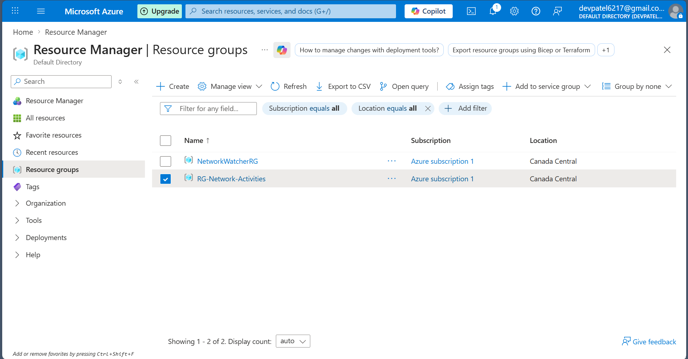

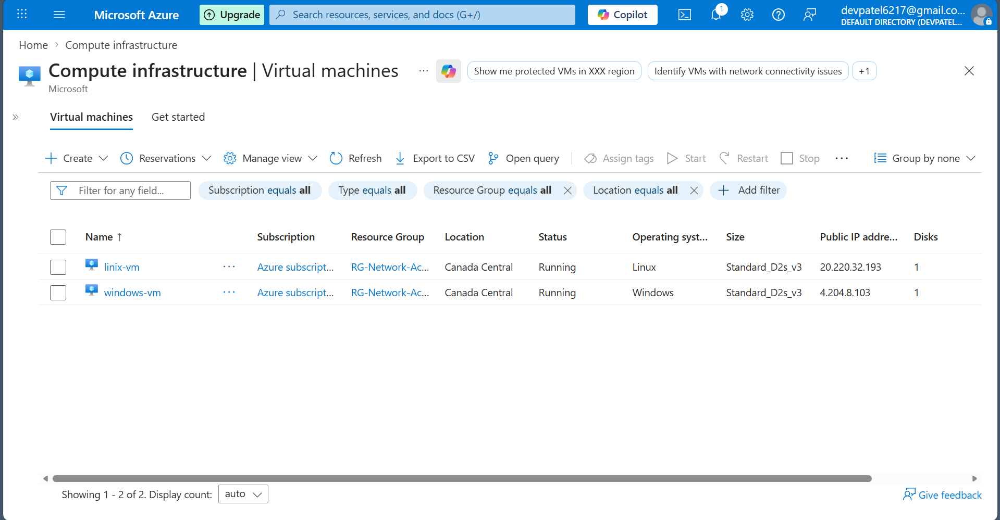

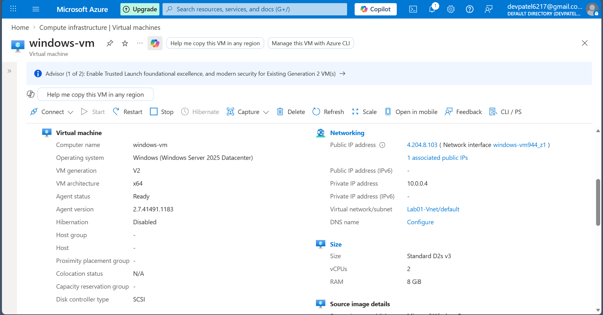

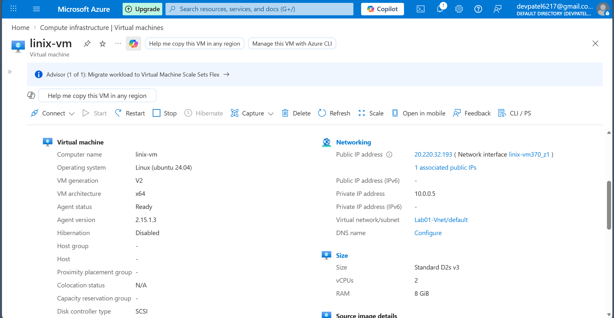

---

## ICMP Analysis

Connected to windows-vm via Remote Desktop and used 
Wireshark to capture ICMP traffic between both VMs 
and toward an external address.

- Applied icmp filter in Wireshark
- Pinged linix-vm at 10.0.0.5 from windows-vm
- Watched Echo Request and Echo Reply packets in real time
- Pinged www.google.com to confirm external routing worked
- 0 percent packet loss across both tests

VM-to-VM ping ran at 1-20ms. External ping to google.com 
resolved to 142.251.157.119 at 8-9ms.

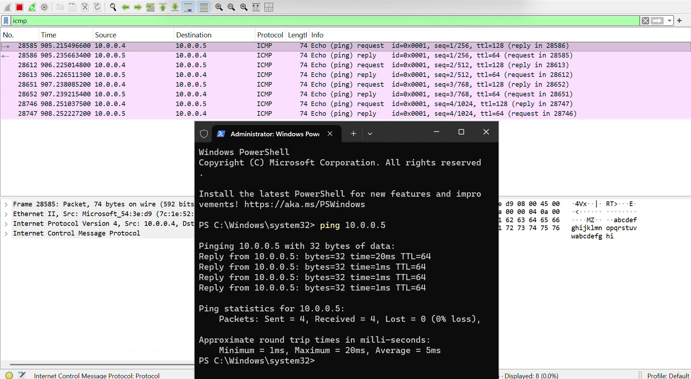

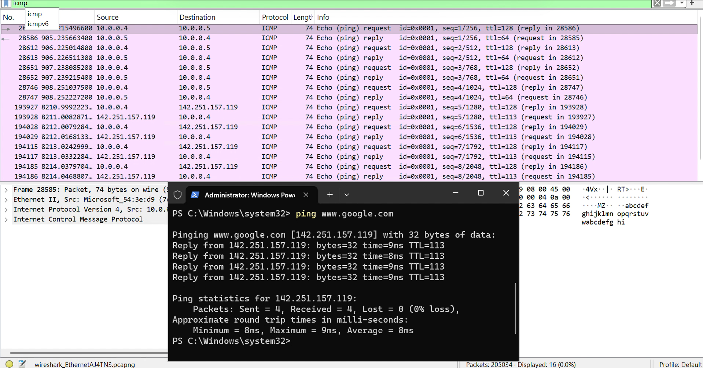

---

## NSG Firewall Configuration

Configured an Azure Network Security Group inbound rule 
to block ICMP traffic to the Ubuntu VM and watched 
the impact in real time.

- Started continuous ping from windows-vm to linix-vm
- Confirmed ongoing replies in Wireshark and PowerShell
- Opened linix-vm-nsg and added an inbound deny rule
- Rule: Priority 290 - Protocol ICMP - Action Deny
- Wireshark immediately showed no response found
- PowerShell showed Request timed out on every line
- Deleted the deny rule - replies came back within seconds

NSG rules take effect immediately without restarting 
the VM. Priority 290 placed this rule above the default 
allow rules, which is why traffic stopped the moment 
it was applied and resumed the moment it was removed.

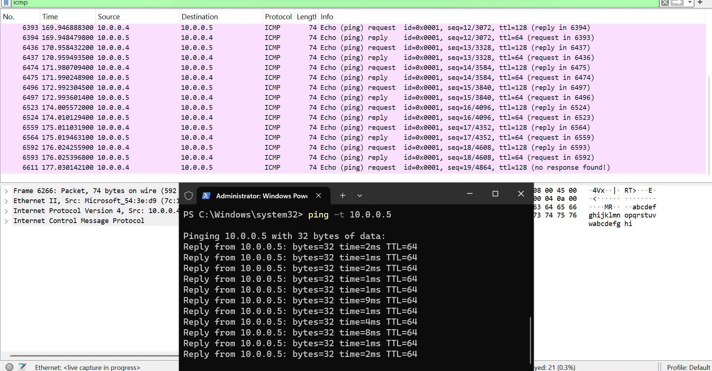

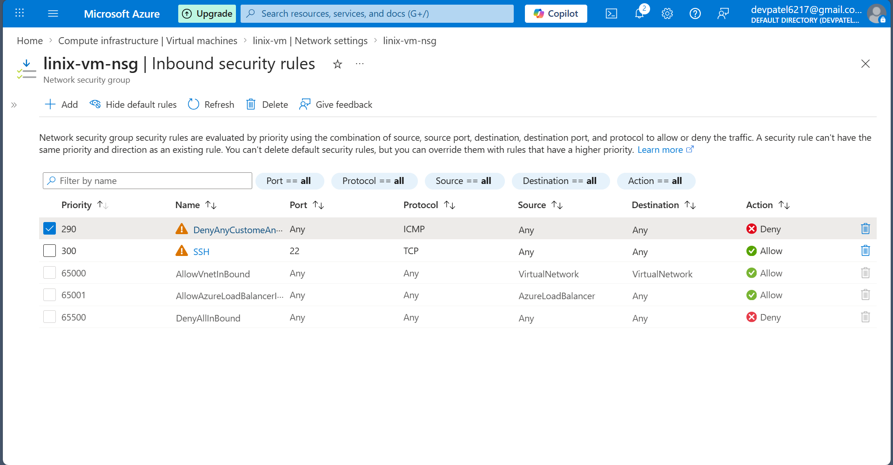

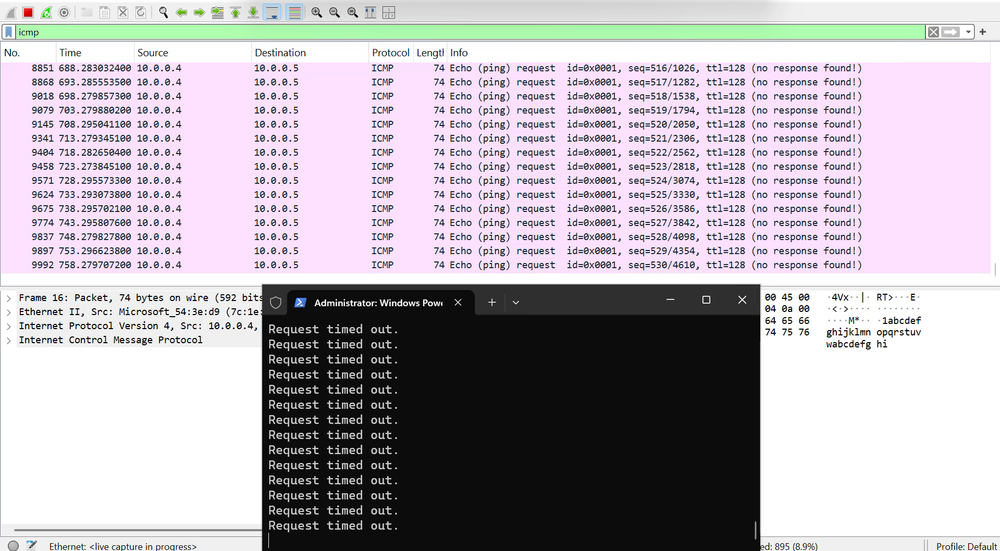

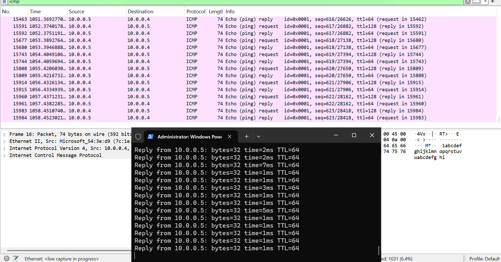

---

## SSH Analysis

SSH'd into linix-vm from windows-vm using PowerShell 
and ran Linux commands to confirm remote access over 
the private VNet connection.

- Connected using: ssh labuser@10.0.0.5
- Authenticated with username and password
- Ran commands: id, hostname, pwd, ls, whoami
- Confirmed user labuser, hostname linix-vm, 
  working directory /home/labuser

SSH encrypts everything between client and server. 
Every command and response travels as encrypted packets. 
The session confirmed full administrative access to 
the Ubuntu VM from the Windows environment using 
private IP addressing inside the shared VNet.

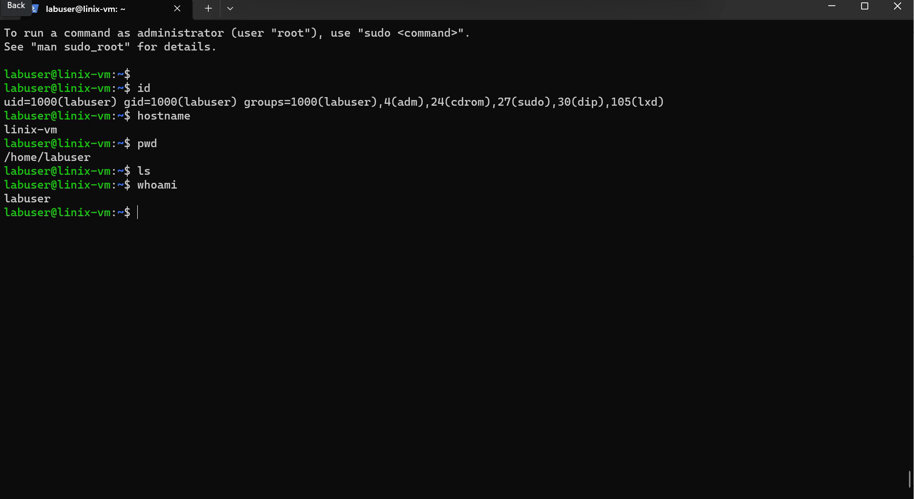

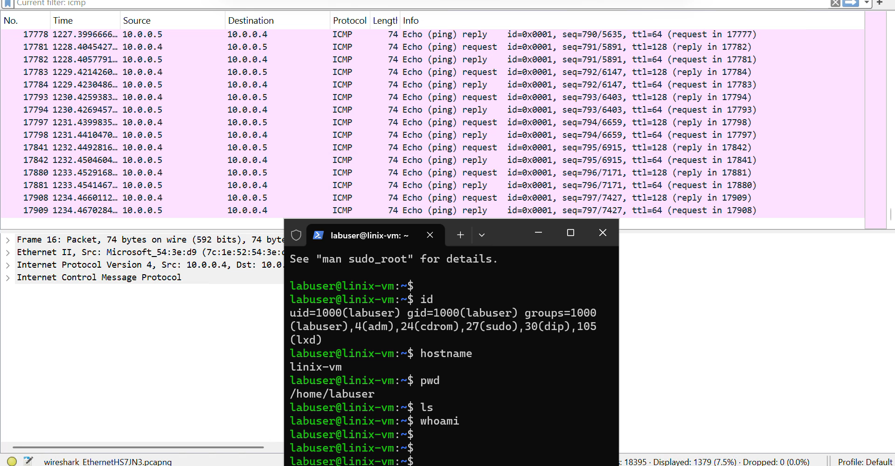

---

## DHCP Analysis

Ran ipconfig /renew on windows-vm and captured the 
full DHCP exchange in Wireshark.

- Applied dhcp filter in Wireshark
- Confirmed no DHCP traffic before running the command
- Opened PowerShell as Administrator
- Ran: ipconfig /renew
- Watched the full sequence play out in Wireshark

DORA sequence captured:
1. DHCP Release - client released existing IP lease
2. DHCP Discover - client broadcast to find DHCP server
3. DHCP Offer - server at 168.63.129.16 offered an address
4. DHCP Request - client requested the offered address
5. DHCP ACK - server confirmed and assigned 10.0.0.4

The whole process completed in under a second. When a 
user cannot connect to the network, ipconfig /renew 
forces this sequence to restart. If any step fails 
in Wireshark during troubleshooting, you can pinpoint 
exactly where the DHCP process broke down.

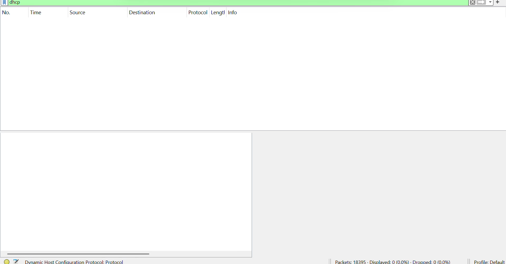

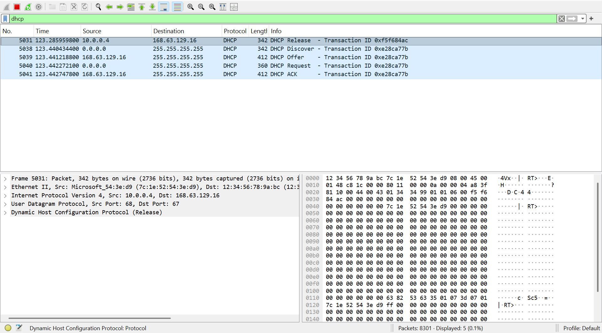

---

## DNS Analysis

Used nslookup to query two external domains from 
windows-vm and captured DNS traffic in Wireshark.

- Applied dns filter in Wireshark
- Ran nslookup google.com
- Ran nslookup disney.com
- Watched query and response packets for each domain

google.com resolved to multiple addresses including 
142.250.139.138 and IPv6 range 2607:f8b0:4023:1804.
disney.com resolved to 130.211.198.204.
DNS server for both: 168.63.129.16 (Azure internal resolver).

When a user says they cannot access a website, the 
first step is checking whether DNS is resolving. 
Running nslookup and watching the packets in Wireshark 
shows immediately if the DNS server is responding 
and returning a valid address.

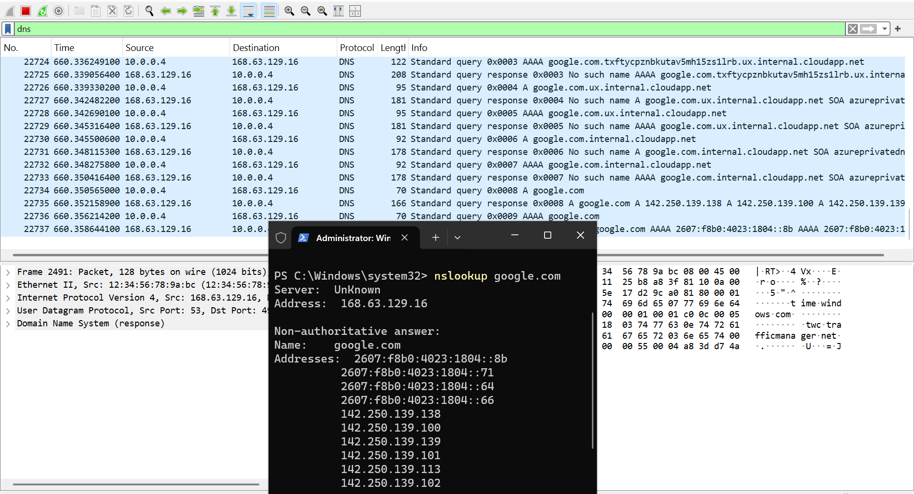

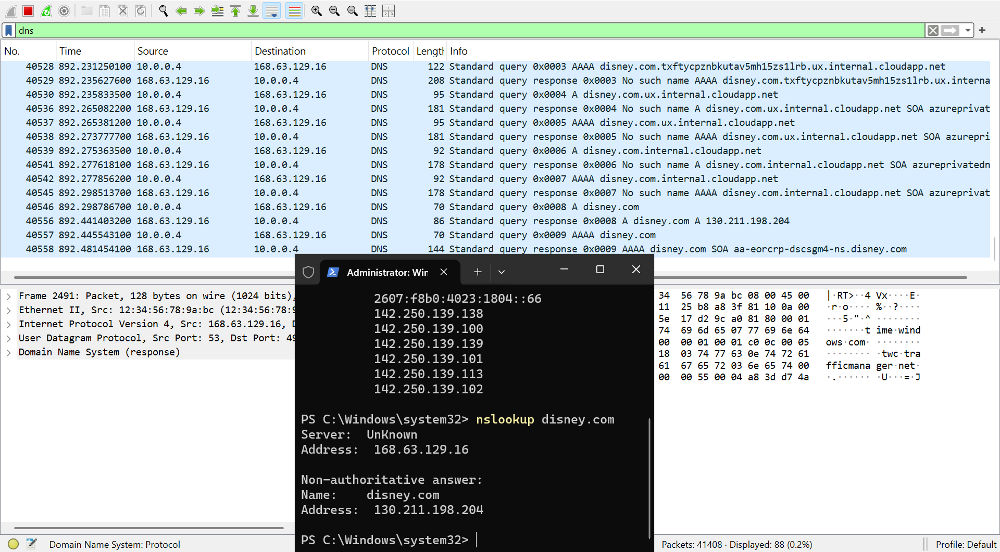

---

## RDP Analysis

Filtered Wireshark for tcp.port == 3389 during an 
active Remote Desktop session with zero user activity.

- Applied filter: tcp.port == 3389
- Sat completely still - no mouse or keyboard input
- Watched the packet stream for 10 seconds

Constant non-stop traffic with nothing happening on 
screen. Over 45,000 packets captured. All traffic 
was TLS-encrypted (TLSv1.3) over TCP port 3389.

RDP streams the entire desktop display continuously. 
Every screen refresh, cursor blink, and background 
process generates packets. It does not wait for user 
input the way ICMP or DNS do. This is why RDP sessions 
consume more bandwidth than other remote access methods 
and why display compression settings matter on 
slow connections.

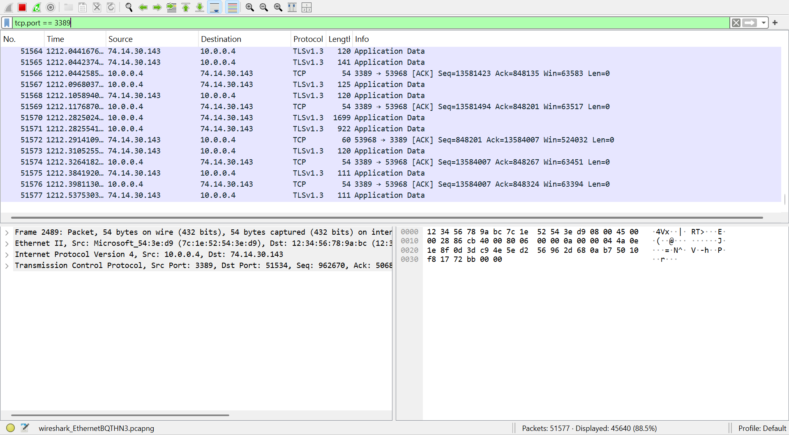

---

## Resource Decommission

All Azure resources deleted after the project was 
complete to prevent ongoing compute costs.

Deleted the entire resource group RG-Network-Activities 
which removed all 11 dependent resources at once 
including both VMs, the Virtual Network, NSG, public 
IPs, network interfaces, and OS disks.

Deleting the resource group is cleaner than removing 
resources individually. Everything tied to the group 
is removed in a single operation with nothing left 
running in the background.

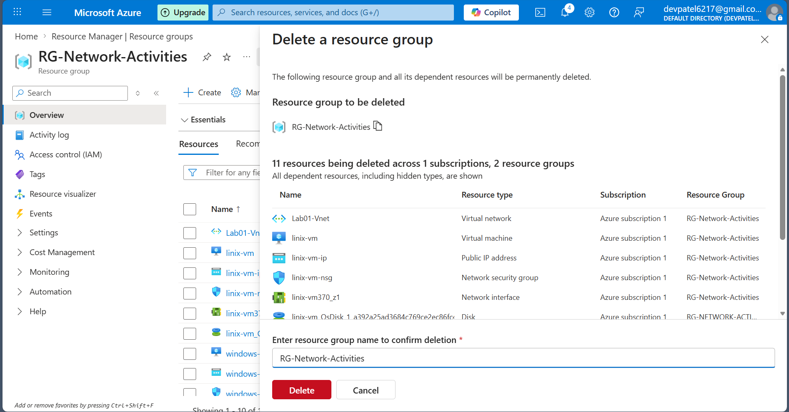
